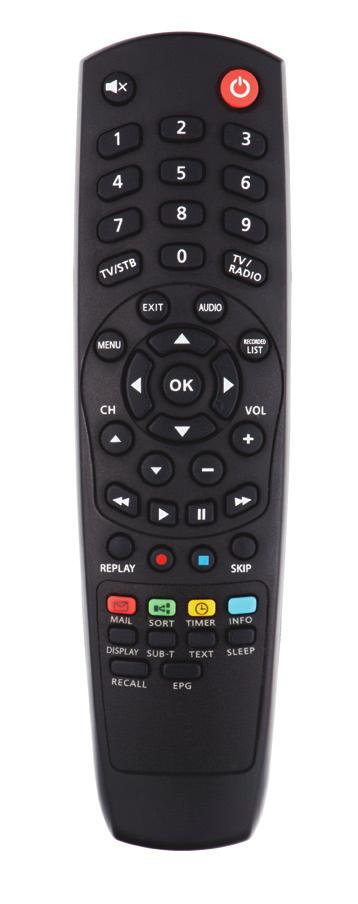
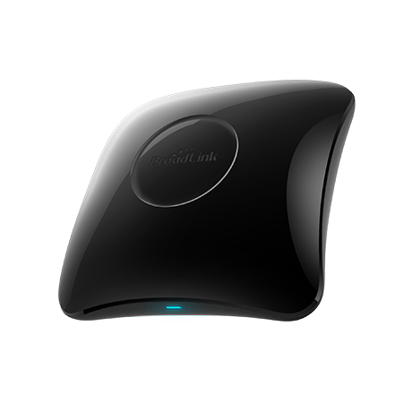

# UPC HD Mediabox remote
{: height="70"}

If you would like to control your UPC HD Mediabox via Home Assistant and you own a Broadlink RM4 pro, here's all what you need.

{: height="650"} {: height="400"}

## Home Assistant card configuration

1. `remote_controller_base.yaml` contains a more generic implementation for Broadlink controller, you can use it for RF commands too.
2. `remote_controller_stb.yaml` calls the base script and simplifies the usage just by providing a command.

    :warning: Do not forget to update RM4 `entity` to match your device.
3. Place `stb_hd_mediabox.jpg` to `/config/www/pictures/stb_hd_mediabox.jpg` to make it available for horizontal stack card
4. Copy all codes from `broadlink_remote_codes` to `/config/.storage/broadlink_remote_*_codes`
5. Add the horizontal stack card wherever you like and paste the content of `horizontal-stack-card.yaml` to it

    :warning: also do not forget to update RM4 `entity` to match your device